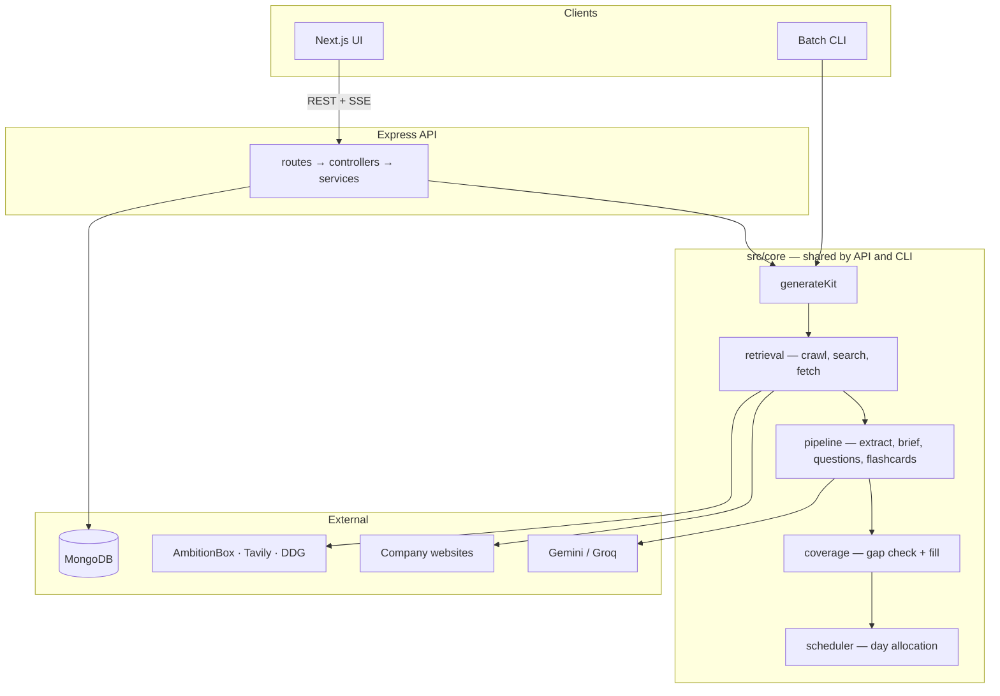
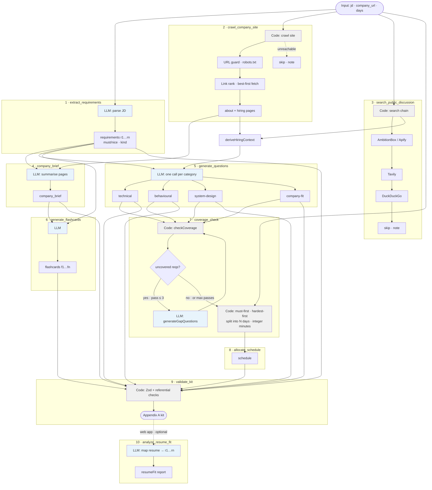
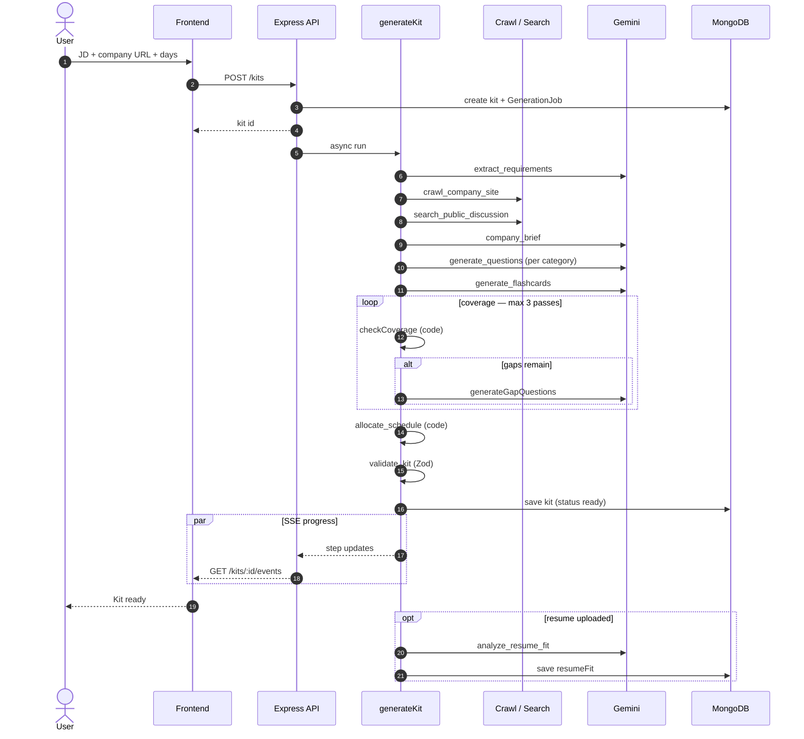

# AI Interview Prep Kit — Backend

Turns a job description + company URL into a structured interview prep kit (Appendix A).

**API:** [https://api-trao.malviya.cloud](https://api-trao.malviya.cloud) · **App:** [https://www.trao.malviya.cloud](https://www.trao.malviya.cloud) · **Repo:** [https://github.com/Atmalviya/trao-backend](https://github.com/Atmalviya/trao-backend)

---

## Overview

Express API + generation pipeline. Users auth via session cookies, create kits through the web UI or batch CLI. Research is real: company sites are crawled, public interview discussion is searched, and the kit is built through deliberate sequential steps — not one mega-prompt.

**Stack:** Node.js 20 · Express 5 · TypeScript · MongoDB Atlas · Gemini (+ Groq fallback) · cheerio · Zod · Vitest

---

## Setup

**Local**

```bash
npm install && cp .env.example .env
npm run dev          # :4000
npm test             # 94 tests
```

**Deployed:** Coolify (Docker) → [https://api-trao.malviya.cloud](https://api-trao.malviya.cloud)

**Batch (Section 9)**

```bash
npm run evaluate -- --input <cases.json> --output <kits.json>
```

Env vars: see `[.env.example](./.env.example)`.

---

## LLM


|          | Provider      | Model                     |
| -------- | ------------- | ------------------------- |
| Primary  | Google Gemini | `gemini-2.5-flash`        |
| Fallback | Groq          | `llama-3.3-70b-versatile` |


Shared rate-limit queue (5 RPM default, backoff on 429). Batch cases run sequentially.

---

## Pipeline


| Step                       | Owner      | Does                                                      |
| -------------------------- | ---------- | --------------------------------------------------------- |
| `extract_requirements`     | LLM        | JD → `r1…rn` (must/nice). Conservative.                   |
| `crawl_company_site`       | Code       | Rank links, crawl, find hiring page. Skip if unreachable. |
| `search_public_discussion` | Code       | AmbitionBox → Tavily → DDG → skip.                        |
| `company_brief`            | LLM        | Summary from fetched pages.                               |
| `generate_questions`       | LLM        | One call per category, weighted by hiring format.         |
| `generate_flashcards`      | LLM        | Cards linked to requirement ids.                          |
| `coverage_check`           | Code + LLM | Gap detection + fill (max 3 passes).                      |
| `allocate_schedule`        | Code       | Exactly N days. Pure arithmetic.                          |
| `validate_kit`             | Code       | Zod vs Appendix A.                                        |


**Retrieval:** No hard-coded paths. Respects robots.txt. Untrusted text wrapped in injection guards.

**Coverage:** Deterministic set check in code. Uncovered must-haves recorded honestly — never invented.

---

## Architecture

**High-level**



`src/core/` has no Express imports — web app and `npm run evaluate` run the same pipeline.

**Kit generation pipeline** (`src/core/generateKit.ts`)



Blue = LLM steps · Grey = deterministic code · Dashed = non-fatal skip or optional path.

**End-to-end request flow**



---

## Builder state

Questions/flashcards carry `origin` (`generated` | `edited` | `manual`) and `pinned`.

Category regen replaces only **generated + unpinned** items. Edited, manual, and pinned survive.

---


## Schedule

Code in `scheduler.ts`: must-haves first → hardest first → split into N days → integer minutes (15/25/40 by difficulty). Extra days = review.

---


## Creative feature: Resume fit

Optional upload (PDF/DOCX/TXT/MD) → per-requirement gap/strength report vs `r1`, `r2`, … Prep intelligence only, not CV rewriting. Non-blocking.

---


## Trade-offs & limitations

- Practice: confidence-weighted sort (unseen → weakest → oldest)
- No headless browser · in-process SSE jobs · max 3 coverage passes
- Partial research → `status: "ok"` with honest notes; `failed` only when no kit produced
- Free-tier RPM is the main batch bottleneck

